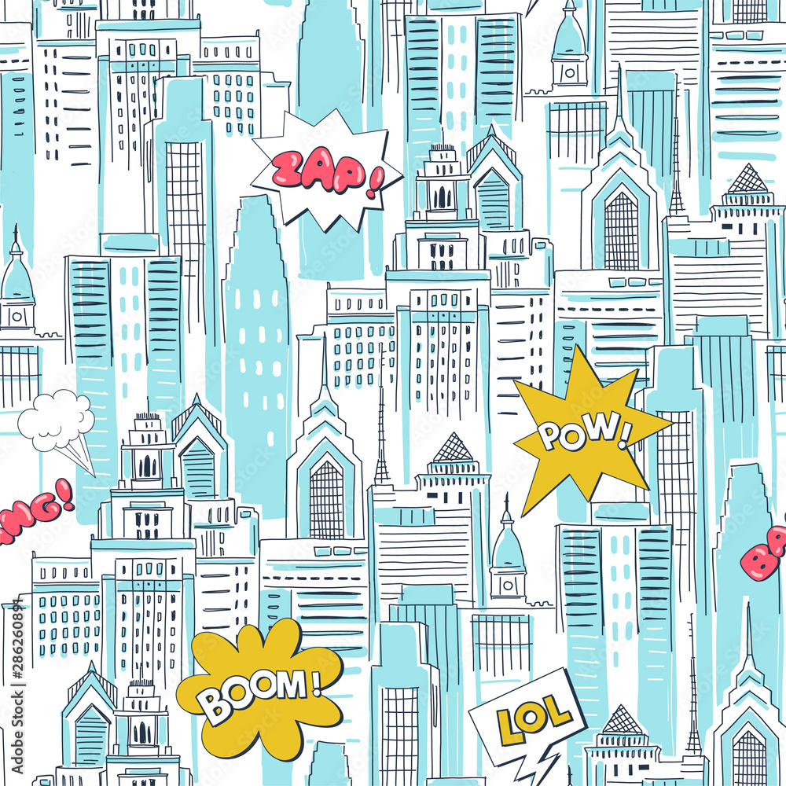

# 📚 DC Comics Bookshelf

A sleek, Apple Books–inspired web app to collect, preview, and wishlist your favorite **DC comic volumes**, powered by the **ComicVine API**.



---

## ✨ Features

- 🔍 **Search by volume name** (e.g. *Batman*, *Crisis*, *Flashpoint*)
- 📖 **Add to Bookshelf** with one click
- 🌟 **Toggle Read/Wishlist** status for each comic
- 🧱 Beautiful **wood-texture shelf layout**
- 🎨 Seamless **comic-style cityscape background**
- 🔄 Built for **responsive devices**
- 🧠 Zero backend — runs entirely client-side

---

## 🚀 Demo

> Live GitHub Pages link:  
[https://lxriva.github.io/Avi-WebDev4-Comics-Bookshelf](https://lxriva.github.io/Avi-WebDev4-Comics-Bookshelf)

---

## 🧰 Technologies

- HTML, CSS, JavaScript (Vanilla)
- ComicVine API (`/volumes/` endpoint via `allorigins` proxy)
- CSS Grid, Flexbox, custom media queries
- Hosted on GitHub Pages

---

## 🔑 Setup & Usage

1. Clone this repo or download the ZIP:
   ```bash
   git clone https://github.com/lxriva/Avi-WebDev4-Comics-Bookshelf.git
   ```

2. Open `index.html` in your browser.

3. Use the **search bar** to find volumes, then add them to your shelf.

4. Toggle between 📖 **Read** or 🌟 **Wishlist**.

> ⚠️ **Note**: ComicVine images may not load on certain restricted networks (e.g. office Wi-Fi). Use a hotspot or test from home for full functionality.

---

## 📂 Folder Structure

```
📁 Avi-WebDev4-Comics-Bookshelf/
│
├── index.html             # Main HTML file
├── style.css              # Main stylesheet
├── assets/
│   └── background.jpg     # Seamless comic background
```

---

## 📌 Roadmap

- [ ] Save bookshelf to `localStorage`
- [ ] Manual import/export (JSON backup)
- [ ] Light/Dark theme toggle
- [ ] Filter by Read / Wishlist
- [ ] Marvel mode (stretch goal 👀)

---

## 🖼️ Credits

- Comic data & covers: [ComicVine API](https://comicvine.gamespot.com/api/)
- Background pattern: Comic cityscape (vector, license for academic/fan use)

---

## 👨‍💻 Created By

**Avi** — a developer, comic collector, and design enthusiast.  
This project was built for **Web Dev Module CM1040**, and powered by snacks and Saturday cartoons.
